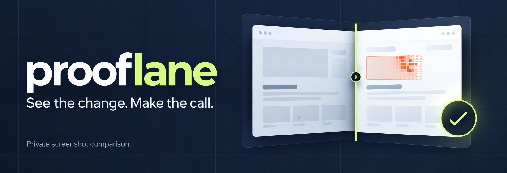
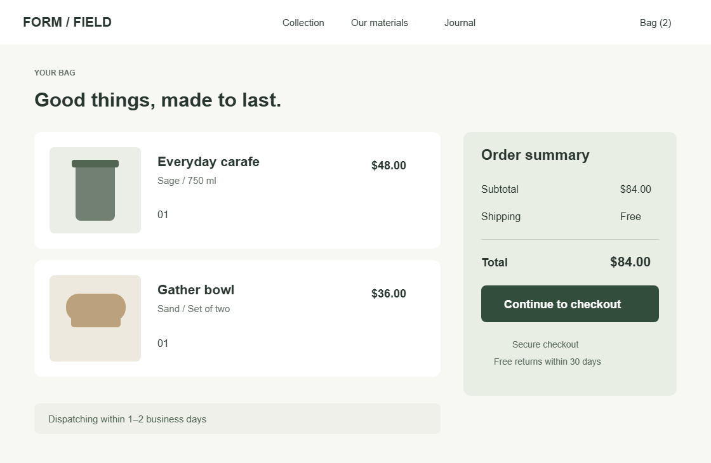
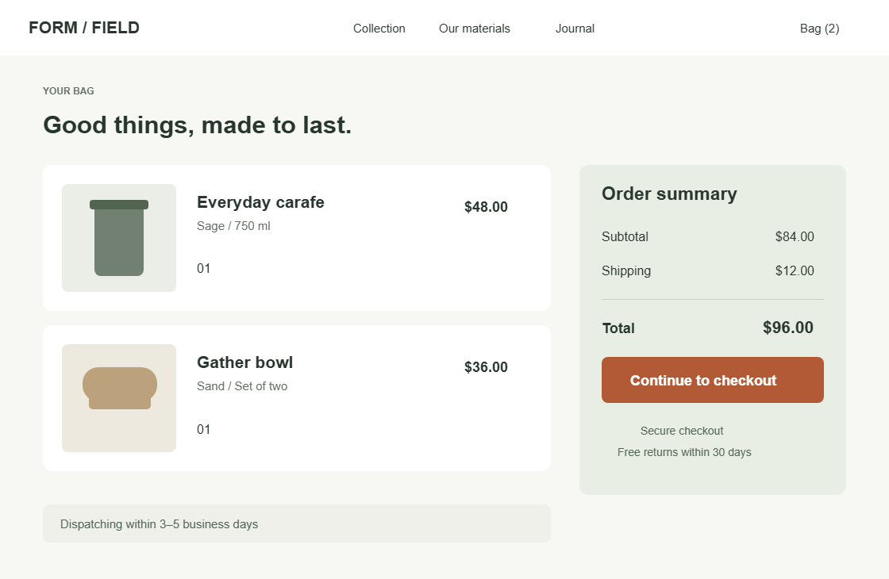
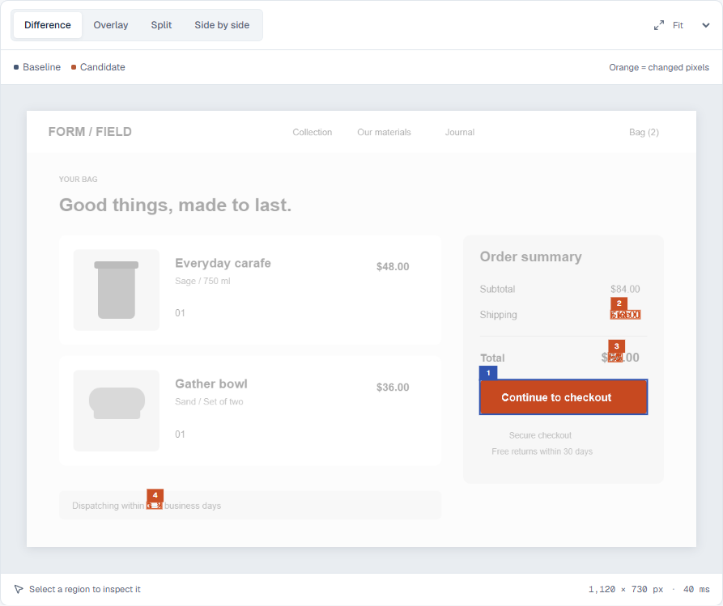
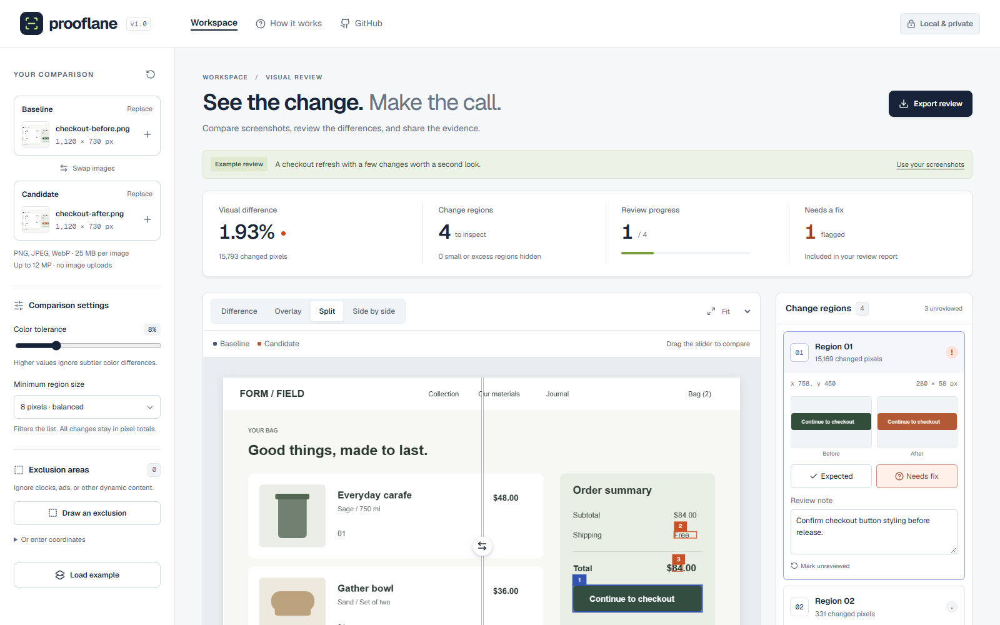

[](https://farzamfattahi.github.io/prooflane/)

# Prooflane

[](https://github.com/FarzamFattahi/prooflane/actions/workflows/ci.yml) [](LICENSE)

**Turn screenshot differences into a reviewed, portable handoff.**

Prooflane is a browser-based workspace for designers, developers, and QA reviewers who need to explain what changed between two images. Compare screenshots locally, exclude known noise, mark each detected region as expected or needing a fix, and export the evidence with your notes.

[Open the app](https://farzamfattahi.github.io/prooflane/) · [Report an issue](https://github.com/farzamfattahi/prooflane/issues) · [Comparison contract](docs/CONTRACT.md)

## See the comparison in action

The built-in checkout example uses two **1,120 × 730** screenshots. The candidate changes the checkout button color, introduces a shipping charge, updates the total, and changes the dispatch estimate.

<table>
  <tr><th>1. Baseline — before</th><th>2. Candidate — after</th></tr>
  <tr>
    <td width="50%"></td>
    <td width="50%"></td>
  </tr>
</table>

**3. Inspect the changed pixels.** Orange pixels exceed the color tolerance; unchanged pixels appear in grayscale. Numbered boxes group nearby changes for review. The blue box marks the currently selected region.



At **8% color tolerance** with an **8-pixel minimum region size**, the real comparison finds **15,793 changed pixels out of 817,600 (1.93%)**, grouped into **4 regions**. The color tolerance measures RGB distance; it is not a confidence score.

| Region | Visible change                      | Changed pixels |
| ------ | ----------------------------------- | -------------: |
| 01     | Checkout button: green → terracotta |         15,169 |
| 02     | Shipping: Free → $12.00             |            331 |
| 03     | Total: $84.00 → $96.00              |            188 |
| 04     | Dispatch: 1–2 → 3–5 business days   |            105 |

<table>
  <tr><th>Region 01 — before</th><th>Region 01 — after</th></tr>
  <tr>
    <td width="50%"></td>
    <td width="50%"></td>
  </tr>
</table>

**4. Make the call.** Select a region, mark it **Expected** or **Needs fix**, and add a note. Prooflane detects the visual difference; the reviewer decides whether it is correct. Export the review as a self-contained HTML report for someone else to inspect offline.

[Open the raw difference PNG](docs/examples/checkout/difference.png) · [Inspect the actual JSON output](docs/examples/checkout/comparison.json) · [Reproduce this example](docs/examples/checkout/README.md)

<details>
<summary>Full review workspace</summary>



</details>

## A useful review loop

1. Load a baseline and a candidate screenshot, or try the built-in example.
2. Inspect the visual comparison and detected change regions. Different image sizes are compared on a shared canvas without stretching.
3. Adjust sensitivity and minimum region size. Exclude areas such as timestamps or rotating content when they are irrelevant to the review.
4. Mark regions as expected or needing a fix and add context for the recipient.
5. Download a standalone HTML report for handoff, structured JSON for your tools, or a difference PNG.

The browser accepts PNG, JPEG, and WebP images up to 25 MB per file. PNG is a good choice for screenshot comparisons because lossy compression can add differences.

The report travels with its images and notes. The recipient can open it without an account or a running Prooflane server. Changing images, settings, or exclusion areas clears decisions so a review cannot silently apply to a different comparison.

## What makes it practical

- **Local processing:** selected images stay in your browser; comparison runs in a Web Worker.
- **Review context:** a difference gets a decision and a note, so the output is actionable.
- **Noise controls:** color-distance threshold, minimum region size, and explicit exclusion rectangles.
- **Portable evidence:** self-contained HTML reports, structured review JSON, and difference PNGs.
- **Two implementations:** a TypeScript browser engine and a Python CLI use the same documented rules and shared golden fixtures.
- **Accessible interface:** semantic controls, keyboard interaction, responsive layout, and automated accessibility checks.

Visual comparison tools already exist. Prooflane's focus is a compact, private workflow from screenshot comparison to reviewed evidence. It makes no claim to be the first image-diff tool or to understand the meaning of a visual change.

## Run locally

Requires Node.js **22.12+**.

```sh
git clone https://github.com/farzamfattahi/prooflane.git
cd prooflane
npm ci
npm run dev
```

Open `http://127.0.0.1:5186`. To build and inspect the production app:

```sh
npm run build
npm run preview
```

The production site uses the `/prooflane/` base path and is available locally at `http://127.0.0.1:4186/prooflane/`.

## Python CLI

The Python implementation supports repeatable file-based comparisons outside the browser. Install it from [the Python package](python/) in a virtual environment:

```sh
python -m venv .venv
# Windows: .venv\Scripts\activate
# macOS / Linux: source .venv/bin/activate
python -m pip install -e ./python
prooflane baseline.png candidate.png --output report.json --diff diff.png
prooflane baseline.png candidate.png --fail-above 0.5
```

See [the Python README](python/README.md) for commands, output formats, and exit-code behavior.

## Comparison rules and limitations

The engine compares overlapping RGBA pixels after compositing transparency over white, using a luminance-weighted RMS color distance. Pixels outside either image count as changed. Exclusion rectangles use half-open integer coordinates. Changed pixels are grouped through connected 16-pixel tiles; regions describe visual evidence rather than semantic UI elements.

The minimum region setting filters the displayed region list, **not** the total changed-pixel count. Omitted regions and pixels remain accounted for. The changed percentage is measured against non-excluded pixels. The engine caps displayed regions at 1,000, each image side at 8,192 pixels, and the shared canvas at 12 million pixels.

Capture screenshots at the same viewport, zoom, and scale for useful results. Font rendering, anti-aliasing, compression, animation, and shifts in layout can all produce differences. Prooflane does not align images, run OCR, detect semantic regressions, or replace a human review. Its threshold is a normalized color distance, not a model confidence score. See [the full contract](docs/CONTRACT.md) for exact behavior.

Exclusions do not redact images. Exported HTML reports include the originals, so inspect them before sharing. Read [security and privacy](SECURITY.md).

## Validation and architecture

```sh
npm test
npm run build
npx playwright install chromium
npm run test:e2e
python -m unittest discover -s python/tests -v
```

On Windows, browser tests use installed Microsoft Edge; CI uses Chromium. The workflow checks the engine, production browser flows, accessibility, and Python fixture parity before deploying the `main` branch to GitHub Pages.

The React interface calls a pure TypeScript comparison engine through a Web Worker. The Python package is independent of the frontend. The app requires no backend, API key, learned model, or runtime third-party assets. Read [the architecture and engineering tradeoffs](docs/ARCHITECTURE.md).

Contributions are welcome; read [CONTRIBUTING.md](CONTRIBUTING.md). Released under the [MIT License](LICENSE).
