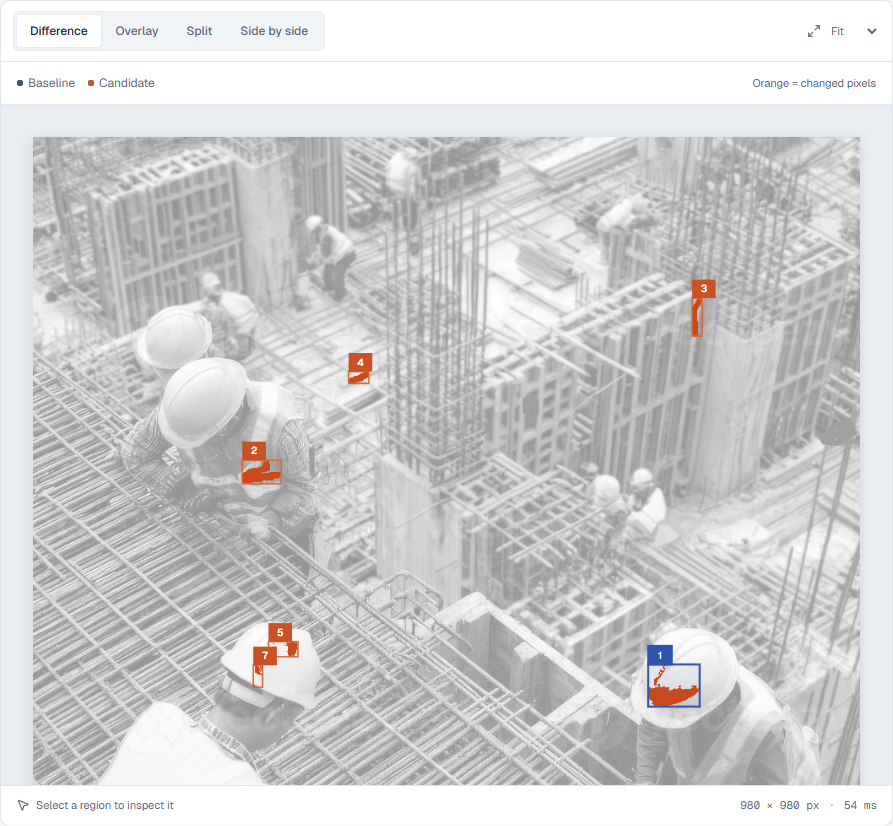
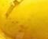
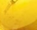

[](https://farzamfattahi.github.io/prooflane/)

# Prooflane

[](https://github.com/FarzamFattahi/prooflane/actions/workflows/ci.yml) [](LICENSE)

**Turn screenshot differences into a reviewed, portable handoff.**

Prooflane is a browser-based workspace for designers, developers, and QA reviewers who need to explain what changed between two images. Compare screenshots locally, exclude known noise, mark each detected region as expected or needing a fix, and export the evidence with your notes.

[Open the app](https://farzamfattahi.github.io/prooflane/) · [Report an issue](https://github.com/farzamfattahi/prooflane/issues) · [Comparison contract](docs/CONTRACT.md)

## Your workers example: find the edited pixels

These are Farzam's two supplied **980 × 980** construction-worker images. The baseline is the original; the candidate contains painted edits. Prooflane compares the actual pixels; it does not recognize workers or assess construction safety.

<table>
<tr><th>Original — baseline</th><th>Edited — candidate</th></tr>
<tr><td width="50%"></td><td width="50%"></td></tr>
</table>

### What Prooflane detects



At **8% color tolerance** and an **8-pixel minimum region size**, the comparison detects **2,620 changed pixels out of 960,400 (0.273%)**, grouped into **seven regions**. Orange pixels exceed the tolerance; grayscale provides unchanged context. Numbered boxes group changes, and blue marks the selected region. Coordinates start at the top-left corner.

| Region | Top-left (x, y) | Bounds (pixels) | Changed pixels |
| ------ | --------------- | --------------- | -------------: |
| 01     | (729, 625)      | 61 × 50         |          1,090 |
| 02     | (248, 383)      | 46 × 28         |            685 |
| 03     | (781, 191)      | 12 × 45         |            296 |
| 04     | (374, 278)      | 24 × 14         |            187 |
| 05     | (279, 598)      | 35 × 18         |            186 |
| 06     | (268, 823)      | 14 × 9          |             95 |
| 07     | (261, 626)      | 11 × 26         |             81 |

The largest region is the painted edit on the lower-right worker's helmet. Other regions include the foreground worker's vest and orange marks on the formwork. The small black and blue edits are not all retained at the default tolerance: nearby dark colors can fall below it. Lower the tolerance to inspect subtler changes; a minimum region size filters displayed regions, not total statistics.

<table>
<tr><th>Selected helmet region — original</th><th>Selected helmet region — edited</th></tr>
<tr><td width="50%"></td><td width="50%"></td></tr>
</table>

Select a region, record **Expected** or **Needs fix**, add a note, and export a portable report. The reviewer decides whether the detected change is correct.

[Difference PNG](docs/examples/workers/difference.png) · [Actual browser JSON](docs/examples/workers/comparison.json) · [Reproduce with Python](docs/examples/workers/README.md)

<details>
<summary>Full review workspace</summary>


</details>

## A useful review loop

1. Load a baseline and a candidate screenshot, or try the built-in example.
2. Inspect the visual comparison and detected change regions. Different image sizes are compared on a shared canvas without stretching.
3. Adjust sensitivity and minimum region size. Exclude areas such as timestamps or rotating content when they are irrelevant to the review.
4. Mark regions as expected or needing a fix and add context for the recipient.
5. Download a standalone HTML report for handoff, structured JSON for your tools, or a difference PNG.

The browser accepts PNG, JPEG, and WebP images up to 25 MB per file. PNG is a good choice for screenshot comparisons because lossy compression can add differences.

The report travels with its images and notes. The recipient can open it without an account or a running Prooflane server. Changing images, settings, or exclusion areas clears decisions so a review cannot silently apply to a different comparison.

## What makes it practical

- **Local processing:** selected images stay in your browser; comparison runs in a Web Worker.
- **Review context:** a difference gets a decision and a note, so the output is actionable.
- **Noise controls:** color-distance threshold, minimum region size, and explicit exclusion rectangles.
- **Portable evidence:** self-contained HTML reports, structured review JSON, and difference PNGs.
- **Two implementations:** a TypeScript browser engine and a Python CLI use the same documented rules and shared golden fixtures.
- **Accessible interface:** semantic controls, keyboard interaction, responsive layout, and automated accessibility checks.

Visual comparison tools already exist. Prooflane's focus is a compact, private workflow from screenshot comparison to reviewed evidence. It makes no claim to be the first image-diff tool or to understand the meaning of a visual change.

## Run locally

Requires Node.js **22.12+**.

```sh
git clone https://github.com/farzamfattahi/prooflane.git
cd prooflane
npm ci
npm run dev
```

Open `http://127.0.0.1:5186`. To build and inspect the production app:

```sh
npm run build
npm run preview
```

The production site uses the `/prooflane/` base path and is available locally at `http://127.0.0.1:4186/prooflane/`.

## Python library and CLI

Install the portable Python package directly from the [v1.1.0 release](https://github.com/FarzamFattahi/prooflane/releases/tag/v1.1.0):

```sh
python -m pip install https://github.com/FarzamFattahi/prooflane/releases/download/v1.1.0/prooflane-1.1.0-py3-none-any.whl
```

```python
from prooflane import compare, render_difference, save_report

result = compare("original.jpg", "edited.jpg")
print(f"{result.changedPercent:.3f}% changed")
for region in result.regions:
    print(region.x, region.y, region.width, region.height, region.pixels)
render_difference("edited.jpg", result).save("difference.png")
save_report(result, "report.json")
```

Accepts file paths, Pillow images, and NumPy uint8 grayscale/RGB/RGBA arrays. Use `result.mask` for segmentation-style integration, `Rect` exclusions for dynamic areas, and threshold settings for your application. OpenCV arrays must be converted from BGR to RGB first.

```sh
prooflane original.jpg edited.jpg --output report.json --diff difference.png
prooflane original.jpg edited.jpg --fail-above 0.5
```

See [the Python API guide](python/README.md) for installation, options, CI integration, and the comparison contract. No API key, GPU, or server is required.

## Comparison rules and limitations

The engine compares overlapping RGBA pixels after compositing transparency over white, using a luminance-weighted RMS color distance. Pixels outside either image count as changed. Exclusion rectangles use half-open integer coordinates. Changed pixels are grouped through connected 16-pixel tiles; regions describe visual evidence rather than semantic UI elements.

The minimum region setting filters the displayed region list, **not** the total changed-pixel count. Omitted regions and pixels remain accounted for. The changed percentage is measured against non-excluded pixels. The engine caps displayed regions at 1,000, each image side at 8,192 pixels, and the shared canvas at 12 million pixels.

Capture screenshots at the same viewport, zoom, and scale for useful results. Font rendering, anti-aliasing, compression, animation, and shifts in layout can all produce differences. Prooflane does not align images, run OCR, detect semantic regressions, or replace a human review. Its threshold is a normalized color distance, not a model confidence score. See [the full contract](docs/CONTRACT.md) for exact behavior.

Exclusions do not redact images. Exported HTML reports include the originals, so inspect them before sharing. Read [security and privacy](SECURITY.md).

## Validation and architecture

```sh
npm test
npm run build
npx playwright install chromium
npm run test:e2e
python -m unittest discover -s python/tests -v
```

On Windows, browser tests use installed Microsoft Edge; CI uses Chromium. The workflow checks the engine, production browser flows, accessibility, and Python fixture parity before deploying the `main` branch to GitHub Pages.

The React interface calls a pure TypeScript comparison engine through a Web Worker. The Python package is independent of the frontend. The app requires no backend, API key, learned model, or runtime third-party assets. Read [the architecture and engineering tradeoffs](docs/ARCHITECTURE.md).

Contributions are welcome; read [CONTRIBUTING.md](CONTRIBUTING.md). Released under the [MIT License](LICENSE).
