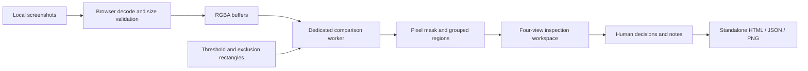

# How Prooflane works

Prooflane is a static app: the host serves JavaScript, styles, and bundled fonts. The browser decodes images, performs the comparison, holds review decisions, and constructs exports. No backend receives screenshots.

The pure engine has no DOM dependency. It composites RGBA on white and compares weighted RGB RMS color distance. Missing dimensions are reported explicitly. A tile graph groups nearby changes; exact changed-pixel bounds and counts are retained. The minimum-region filter affects the queue only. Total statistics never discard filtered changes.

Comparison effects terminate obsolete workers when settings or input images change. Upload generation counters prevent a slow image decode from replacing a newer selection. Review decisions are cleared when the comparison changes; coordinate IDs are stable within a comparison but do not justify carrying decisions across changed inputs.

The difference map uses grayscale for unchanged pixels and orange for changed pixels. This visual map is rendered at the original union dimensions. Screenshot crops assist region review; they do not change comparison resolution. A visual difference is evidence for a reviewer, not a prediction of a defect.

## Portable reports

HTML exports embed both screenshots, a difference map, region decisions, notes, settings, and decoded-pixel SHA-256 hashes. They need no network connection or external font. Supplied text is escaped and the report's Content Security Policy disallows scripts and external content. Excluded areas remain visible in the original screenshots; exclusion is not redaction.

JSON exports contain metadata and review notes, but no image data. They are an integration format, not a saved workspace. Reports use schema version 1 and engine ID `prooflane-rgb-v1`. The SHA-256 fields identify decoded RGBA bytes before white compositing, not original image file bytes.

## Python automation

The Python package uses NumPy and Pillow with the same pixel and region rules. Shared golden fixtures check decoded RGBA parity. The CLI additionally handles image files, EXIF normalization, output path protection, and a changed-percentage budget for CI. Browser and Pillow decoders can produce different pixels for color-managed or lossy files; lossless PNG captures with consistent rendering are recommended.

## Bounds and known tradeoffs

- Each side is limited to 8,192 pixels and the union canvas to 12 million pixels; browser files are limited to 25 MB.
- Up to 1,000 regions are displayed, with omitted counts retained. The browser allows up to 50 explicit exclusions.
- Eight-neighbor connectivity of 16-pixel tiles can combine separate nearby shapes. Regions are spatial groups, not detected UI elements.
- Text antialiasing, JPEG compression, animated content, and layout shifts can create noise. There is no registration, OCR, DOM inspection, SSIM, or learned semantic model.
- Inputs and decisions live in tab memory and are lost on reload. Large images and embedded reports use proportionally more memory.
- The public CI pipeline tests the optimized static build before publishing GitHub Pages. Production assets use the repository's `/prooflane/` path.
